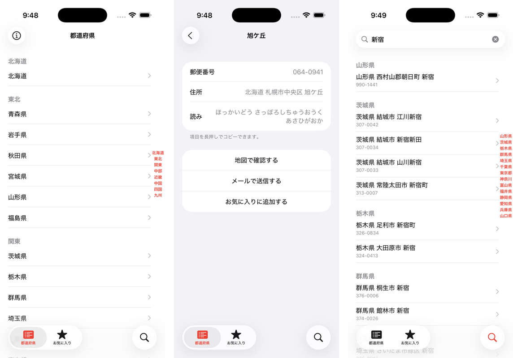

# オフライン郵便番号検索の決定版！ - 郵便番号検索くん

> 日本全国15万人が使ってる郵便番号アプリの決定版！郵便番号を快適に検索できる無料のアプリです。  
> 郵便番号の検索は、電波がなくても行えます。



[](https://itunes.apple.com/jp/app/id578073498?mt=8&uo=4&at=11l3RT)

## 郵便番号データの更新フロー

1. [zipcloud](http://zipcloud.ibsnet.co.jp/) から全国一括データ `ken-allYYYYMM.zip` をダウンロードして解凍する
1. 解凍した `KEN_ALL.CSV` をリポジトリ直下に置いて変換する
   ```bash
   ruby csv2sqlite.rb
   ```
1. 作成した `data.sqlite` を `data_YYYYMM.sqlite` にリネームし、`PostalCode/` の古いファイルと差し替える
   ```bash
   mv data.sqlite PostalCode/data_202608.sqlite
   rm KEN_ALL.CSV
   ```
1. `PostalCode/Repository/PostalCodeRepository.swift` の `databaseName` を新しいファイル名に合わせる
1. `PostalCode/ViewController/AboutViewController.swift` の「郵便番号データ」の日付を、zipcloud に表示されている「YYYY年M月D日更新分」に合わせる

## License

<a rel="license" href="http://creativecommons.org/licenses/by-nc-nd/4.0/"></a><br />この 作品 は <a rel="license" href="http://creativecommons.org/licenses/by-nc-nd/4.0/">クリエイティブ・コモンズ 表示 - 非営利 - 改変禁止 4.0 国際 ライセンス</a>の下に提供されています。
